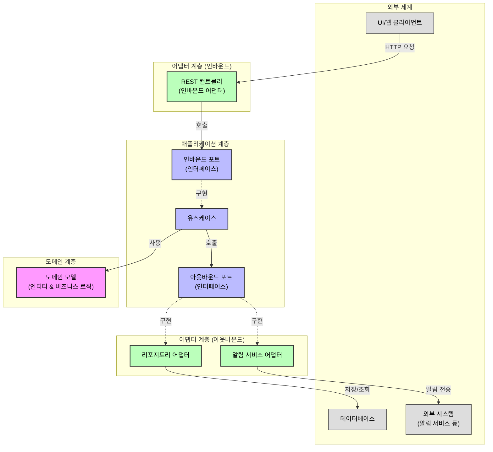
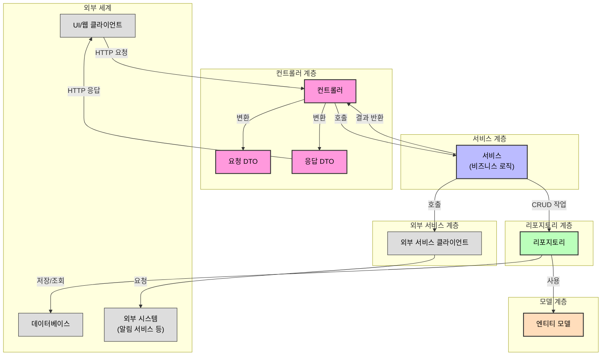

# 헥사고날 아키텍처 vs 레이어드 아키텍처

이 프로젝트는 헥사고날 아키텍처(Hexagonal Architecture)와 레이어드 아키텍처(Layered Architecture)를 비교하기 위한 예제 프로젝트입니다. 두 아키텍처의 차이점을 명확하게 보여주기 위해 동일한 기능을 두 가지 다른 아키텍처 패턴으로 구현했습니다.

## 프로젝트 개요

### 구현 기능: Todo 관리 시스템

이 프로젝트에서는 간단한 Todo 관리 시스템을 구현하여 두 아키텍처를 비교합니다. 구현된 기능은 다음과 같습니다:

- Todo 항목 생성, 조회, 수정, 삭제 (CRUD)
- Todo 완료 상태 변경

### 아키텍처 비교

#### 헥사고날 아키텍처 (포트와 어댑터)

헥사고날 아키텍처는 도메인 중심의 설계로, 내부 도메인 로직과 외부 인프라스트럭처를 명확하게 분리합니다.

- **도메인 계층**: 핵심 비즈니스 로직과 엔티티
- **애플리케이션 계층**: 유스케이스와 포트 인터페이스
- **어댑터 계층**: 외부 세계와의 통신을 담당
  - 인바운드 어댑터: REST 컨트롤러
  - 아웃바운드 어댑터: 데이터베이스 리포지토리

#### 레이어드 아키텍처

레이어드 아키텍처는 계층형 구조로, 각 계층이 명확한 책임을 가지고 있습니다.

- **컨트롤러 계층**: 사용자 요청 처리
- **서비스 계층**: 비즈니스 로직 처리
- **리포지토리 계층**: 데이터 액세스
- **모델 계층**: 데이터 모델 및 엔티티
- **DTO 계층**: 데이터 전송 객체
- **설정 계층**: 애플리케이션 설정

## 주요 차이점

### 1. 의존성 방향

- **헥사고날**: 외부에서 내부로 향함 (adapter → application → domain)
- **레이어드**: 상위 계층에서 하위 계층으로 향함 (controller → service → repository)

### 2. 도메인 로직 위치

- **헥사고날**: 도메인 계층에 캡슐화
- **레이어드**: 서비스 계층에 집중

### 3. 테스트 용이성

- **헥사고날**: 포트를 통한 모킹으로 단위 테스트 용이
- **레이어드**: 계층 간 의존성으로 인해 통합 테스트 중심

## 아키텍처 흐름도

### 헥사고날 아키텍처 흐름도



### 레이어드 아키텍처 흐름도



### 흐름도로 보는 주요 차이점

1. **의존성 방향**

   - **헥사고날 아키텍처**: 의존성이 항상 도메인 중심으로 향합니다. 외부 시스템은 포트 인터페이스를 통해 도메인과 통신합니다.
   - **레이어드 아키텍처**: 의존성이 상위 계층에서 하위 계층으로 단방향으로 흐릅니다.

2. **비즈니스 로직 위치**

   - **헥사고날**: 비즈니스 로직이 도메인 모델 내에 캡슐화되어 있습니다.
   - **레이어드**: 비즈니스 로직이 주로 서비스 계층에 집중되어 있습니다.

3. **외부 시스템과의 통합**
   - **헥사고날 아키텍처**: 포트와 어댑터를 통해 외부 시스템과 통합됩니다.
   - **레이어드 아키텍처**: 서비스 계층이 외부 시스템 클라이언트에 직접 의존합니다.

## 쉽게 이해하는 두 아키텍처의 차이

### 헥사고날 아키텍처 (육각형 아키텍처)

헥사고날 아키텍처는 마치 **핵심 비즈니스 로직을 보호하는 성벽**과 같습니다. 외부 세계와의 모든 통신은 '포트'라는 문을 통해서만 이루어집니다.

#### 핵심 개념 쉽게 이해하기

1. **도메인 중심**: 비즈니스 로직이 가장 중요하며, 이를 외부 영향으로부터 보호합니다.

   - 예시: Todo 객체가 자신의 상태를 스스로 변경하는 `markAsCompleted()` 메서드를 가짐

2. **포트와 어댑터**:

   - **포트**: 성벽의 '문'으로, 내부와 외부 세계를 연결하는 인터페이스
   - **어댑터**: 외부 세계와 포트를 연결하는 '번역기'
   - 예시: `SendNotificationPort` 인터페이스(포트)와 이를 구현한 `NotificationAdapter`(어댑터)

3. **의존성 역전**: 외부 시스템이 내부 도메인에 맞춰야 함 (내부가 외부에 의존하지 않음)

   - 예시: 도메인 서비스가 구체적인 알림 서비스가 아닌 `SendNotificationPort` 인터페이스에 의존

4. **장점**:
   - 외부 시스템 변경에 영향을 덜 받음 (데이터베이스나 UI 변경이 도메인 로직에 영향 없음)
   - 테스트가 용이함 (포트 인터페이스를 모킹하여 단위 테스트 가능)
   - 도메인 로직이 명확하게 분리됨

### 레이어드 아키텍처 (계층형 아키텍처)

레이어드 아키텍처는 **케이크 층**처럼 여러 계층이 쌓여 있는 구조입니다. 각 계층은 바로 아래 계층에만 의존합니다.

#### 핵심 개념 쉽게 이해하기

1. **계층 구조**: 각 계층이 명확한 역할을 가지며, 위에서 아래로 의존성이 흐름

   - 예시: 컨트롤러 → 서비스 → 리포지토리 순으로 호출

2. **직접적인 의존성**: 각 계층이 바로 아래 계층에 직접 의존

   - 예시: 서비스 계층이 `LayeredTodoRepository`와 `ExternalNotificationService`에 직접 의존

3. **비즈니스 로직 위치**: 주로 서비스 계층에 비즈니스 로직이 집중됨

   - 예시: Todo 완료 처리 로직이 `LayeredTodoService.completeTodo()` 메서드에 구현됨

4. **장점**:
   - 이해하기 쉬운 단순한 구조
   - 개발자들에게 친숙한 패턴
   - 작은 프로젝트에 적합

### 실제 코드로 보는 차이점

#### 외부 시스템(알림 서비스) 호출 방식

**헥사고날 아키텍처**:

```java
// 서비스는 포트 인터페이스에 의존
private final SendNotificationPort sendNotificationPort;

// 포트 인터페이스를 통해 외부 시스템 호출
sendNotificationPort.sendCompletionNotification(todoId, title);
```

**레이어드 아키텍처**:

```java
// 서비스가 외부 시스템에 직접 의존
private final ExternalNotificationService notificationService;

// 외부 시스템 직접 호출
notificationService.sendCompletionNotification(todoId, title);
```

#### 도메인 로직 구현 방식

**헥사고날 아키텍처**:

```java
// 도메인 객체가 비즈니스 로직을 포함
public class Todo {
    public void markAsCompleted() {
        this.completed = true;
        this.updatedAt = LocalDateTime.now();
    }
}

// 서비스에서 도메인 객체의 메서드 호출
todo.markAsCompleted();
```

**레이어드 아키텍처**:

```java
// 도메인 객체는 주로 데이터 저장 용도
public class Todo {
    private boolean completed;
    // getter, setter만 존재
}

// 비즈니스 로직이 서비스 계층에 구현됨
todo.setCompleted(true);
todo.setUpdatedAt(LocalDateTime.now());
```

## 기술 스택

- Java 17
- Spring Boot 3.4.3
- Spring Data JPA
- H2 Database (개발용)
- Lombok
- RestTemplate (서비스 간 통신)
- Docker Compose (컨테이너 관리)

## 프로젝트 구조

```
src/main/java/com/example/hexagonalvslayered/
├── hexagonal/
│   ├── domain/         # 도메인 모델 및 비즈니스 로직
│   ├── application/    # 유스케이스 및 포트 인터페이스
│   └── adapter/        # 어댑터 구현체
│       ├── in/         # 인바운드 어댑터 (컨트롤러)
│       └── out/        # 아웃바운드 어댑터 (리포지토리, REST API)
│
└── layered/
    ├── controller/     # 컨트롤러 계층
    ├── service/        # 서비스 계층
    ├── repository/     # 리포지토리 계층
    ├── model/          # 모델/엔티티 계층
    ├── dto/            # DTO 계층
    └── config/         # 설정 계층
```

## 실행 방법

### 애플리케이션 실행

```bash
./gradlew bootRun
```

## API 엔드포인트

### 헥사고날 아키텍처 API

- `GET /api/hexagonal/todos`: 모든 Todo 항목 조회
- `GET /api/hexagonal/todos/{id}`: 특정 Todo 항목 조회
- `POST /api/hexagonal/todos`: 새 Todo 항목 생성
- `PUT /api/hexagonal/todos/{id}`: Todo 항목 수정
- `DELETE /api/hexagonal/todos/{id}`: Todo 항목 삭제
- `PATCH /api/hexagonal/todos/{id}/complete`: Todo 항목 완료 상태 변경

### 레이어드 아키텍처 API

- `GET /api/layered/todos`: 모든 Todo 항목 조회
- `GET /api/layered/todos/{id}`: 특정 Todo 항목 조회
- `POST /api/layered/todos`: 새 Todo 항목 생성
- `PUT /api/layered/todos/{id}`: Todo 항목 수정
- `DELETE /api/layered/todos/{id}`: Todo 항목 삭제
- `PATCH /api/layered/todos/{id}/complete`: Todo 항목 완료 상태 변경

## 테스트 코드

이 프로젝트는 두 아키텍처의 차이점을 테스트 코드로 보여줍니다.

### 아키텍처 비교 테스트

`ArchitectureComparisonTest` 클래스는 두 아키텍처의 주요 차이점을 테스트로 검증합니다:

#### 1. 외부 시스템 통합 방식 테스트

레이어드 아키텍처에서는 서비스가 외부 시스템을 직접 참조하지만, 헥사고날 아키텍처에서는 인터페이스(포트)를 통해 간접적으로 참조합니다:

```java
@Test
void testExternalSystemIntegration() {
    // 헥사고날 아키텍처: 포트 인터페이스를 통한 통합
    TodoUseCase hexagonalUseCase = new HexagonalTodoService(mockTodoRepository, mockNotificationPort);

    // 레이어드 아키텍처: 직접 의존성을 통한 통합
    LayeredTodoService layeredService = new LayeredTodoService(mockTodoRepository, mockNotificationService);

    // 헥사고날 방식에서는 모킹된 포트 인터페이스를 통해 외부 시스템과 통신
    verify(mockNotificationPort).sendCompletionNotification(any(), any());

    // 레이어드 방식에서는 구체적인 서비스 구현체를 직접 호출
    verify(mockNotificationService).sendCompletionNotification(any(), any());
}
```

**쉽게 이해하기**: 레이어드 아키텍처에서는 직접 전화번호를 알고 전화하는 것과 같고, 헥사고날 아키텍처에서는 비서(인터페이스)에게 "누구에게 전화해줘"라고 부탁하는 것과 같습니다.

#### 2. 도메인 로직 위치 테스트

레이어드 아키텍처에서는 비즈니스 로직이 주로 서비스 계층에 있지만, 헥사고날 아키텍처에서는 도메인 객체가 자신의 로직을 직접 가집니다:

```java
@Test
void testDomainLogicLocation() {
    // 헥사고날 아키텍처: 도메인 모델에 비즈니스 로직 존재
    Todo hexagonalTodo = new Todo("Complete tests");
    hexagonalTodo.markAsCompleted();  // 도메인 객체가 비즈니스 로직 수행
    assertTrue(hexagonalTodo.isCompleted());

    // 레이어드 아키텍처: 서비스 계층에 비즈니스 로직 존재
    Todo layeredTodo = new Todo("Complete tests");
    layeredTodoService.completeTodo(layeredTodo);  // 서비스가 비즈니스 로직 수행
    assertTrue(layeredTodo.isCompleted());
}
```

**쉽게 이해하기**: 레이어드 아키텍처는 데이터(Todo)와 행동(서비스)이 분리된 것이고, 헥사고날 아키텍처는 데이터와 행동이 함께 있는 것입니다. 자동차를 생각해보면, 레이어드는 "운전자(서비스)가 자동차(모델)를 운전하는" 구조이고, 헥사고날은 "자동차가 스스로 운전하는 기능을 가진" 구조입니다.

#### 3. 외부 시스템 장애 격리 테스트

외부 시스템에 문제가 생겼을 때 두 아키텍처의 대응 방식 차이를 보여줍니다:

```java
@Test
void testExternalSystemFailureIsolation() {
    // 헥사고날 아키텍처: 어댑터에서 장애 발생 시 격리 가능
    doThrow(new RuntimeException("External system failure"))
        .when(mockNotificationPort).sendCompletionNotification(any(), any());

    // 격리된 장애 처리 로직으로 인해 핵심 비즈니스 로직은 계속 동작
    Todo todo = hexagonalTodoService.completeTodo(1L);
    assertTrue(todo.isCompleted());

    // 레이어드 아키텍처: 외부 시스템 장애가 직접 영향을 미칠 수 있음
    doThrow(new RuntimeException("External system failure"))
        .when(mockNotificationService).sendCompletionNotification(any(), any());

    // 예외 처리가 없으면 비즈니스 로직 실행이 중단될 수 있음
    assertThrows(RuntimeException.class, () -> layeredTodoService.completeTodo(1L));
}
```

**쉽게 이해하기**: 레이어드 아키텍처는 한 부품이 고장나면 전체 기계가 멈출 수 있지만, 헥사고날 아키텍처는 한 부품이 고장나도 핵심 기능은 계속 작동할 수 있습니다. 식당으로 비유하면, 레이어드는 주방(비즈니스 로직)과 홀(외부 시스템)이 직접 연결된 구조라 홀에 문제가 생기면 주방 작업도 중단될 수 있지만, 헥사고날은 주방과 홀 사이에 푸드 패스(포트)가 있어 홀에 문제가 생겨도 주방은 계속 음식을 만들 수 있습니다.

### 테스트 방식의 차이

#### 헥사고날 아키텍처의 테스트 방식

헥사고날 아키텍처에서는 인터페이스(포트)를 이용해 외부 시스템을 가짜(mock)로 대체하기 쉽기 때문에, 단위 테스트가 간편합니다:

```java
@Test
void testHexagonalTodoCompletionUseCase() {
    // 모든 외부 의존성을 모킹하여 순수한 단위 테스트 가능
    HexagonalTodoRepository mockRepo = mock(HexagonalTodoRepository.class);
    SendNotificationPort mockNotificationPort = mock(SendNotificationPort.class);

    // 테스트 데이터 준비
    Todo todo = new Todo(1L, "Write tests", false);
    when(mockRepo.findById(1L)).thenReturn(Optional.of(todo));

    // 유스케이스 실행
    TodoUseCase useCase = new HexagonalTodoService(mockRepo, mockNotificationPort);
    useCase.completeTodo(1L);

    // 도메인 로직 검증
    assertTrue(todo.isCompleted());

    // 포트 호출 검증
    verify(mockNotificationPort).sendCompletionNotification(eq(1L), eq("Write tests"));
    verify(mockRepo).save(todo);
}
```

**쉽게 이해하기**: 진짜 친구들 없이도 롤플레잉 게임을 할 수 있는 것처럼, 진짜 데이터베이스나 외부 서비스 없이도 비즈니스 로직을 테스트할 수 있습니다.

#### 레이어드 아키텍처의 테스트 방식

레이어드 아키텍처에서는 계층 간 직접적인 의존성으로 인해 통합 테스트가 더 많이 필요합니다:

```java
@Test
void testLayeredTodoCompletionService() {
    // 실제 리포지토리와 서비스를 사용한 통합 테스트 필요성 높음
    LayeredTodoRepository repository = new JpaLayeredTodoRepository();
    ExternalNotificationService notificationService = new ExternalNotificationService();

    // 서비스 계층 테스트
    LayeredTodoService service = new LayeredTodoService(repository, notificationService);
    Todo todo = new Todo(1L, "Write tests", false);
    repository.save(todo);

    service.completeTodo(1L);

    // 상태 변경 및 부수 효과 검증 필요
    Todo updatedTodo = repository.findById(1L).orElseThrow();
    assertTrue(updatedTodo.isCompleted());
}
```

**쉽게 이해하기**: 전체 자전거를 조립해서 테스트해야 제대로 작동하는지 알 수 있는 것처럼, 모든 계층을 함께 테스트해야 하는 경우가 많습니다.

### 이벤트 통신 테스트 (REST API 예시)

헥사고날 아키텍처에서는 서비스 간 직접 호출 대신 REST API를 통한 이벤트 통신을 사용할 수 있습니다:

#### 1. 이벤트 발행 테스트

```java
@Test
void testPublishTodoCompletedEvent() {
    // REST API를 통한 이벤트 발행 어댑터 테스트
    RestApiEventPublisherAdapter publisher = new RestApiEventPublisherAdapter(restTemplate);
    TodoCompletedEvent event = new TodoCompletedEvent(1L, "Test Todo");

    publisher.publishTodoCompletedEvent(event);

    // 웹훅/API 호출이 발생했는지 검증
    verify(restTemplate).postForEntity(
        eq("http://notification-service/api/events"),
        eq(event),
        any()
    );
}
```

**쉽게 이해하기**: 직접 다른 팀에게 이메일을 보내는 것과 같습니다. 이메일을 받은 팀은 필요한 조치를 취할 수 있습니다.

#### 2. 이벤트 수신 테스트

```java
@Test
void testConsumeTodoCompletedEvent() {
    // 웹훅으로 이벤트 수신 테스트
    TodoCompletedEvent event = new TodoCompletedEvent(1L, "Test Todo");

    // REST 컨트롤러를 통해 이벤트 수신
    eventController.receiveEvent(event);

    // 이벤트 처리 검증
    verify(notificationService).sendCompletionNotification(1L, "Test Todo");
}
```

**쉽게 이해하기**: 이메일을 받고 해당 업무를 처리하는 것과 같습니다.

#### 3. 두 아키텍처의 이벤트 처리 방식 비교

```java
@Test
void compareEventHandlingApproaches() {
    // 헥사고날 아키텍처: REST API를 통한 이벤트 기반 통신
    hexagonalTodoService.completeTodo(1L);
    // 이벤트가 발행되고 REST API를 통해 전달됨
    verify(eventPublisherPort).publishTodoCompletedEvent(any(TodoCompletedEvent.class));

    // 레이어드 아키텍처: 직접 동기 호출
    layeredTodoService.completeTodo(1L);
    // 서비스가 외부 시스템을 직접 호출
    verify(notificationService).sendCompletionNotification(eq(1L), any());
}
```

**쉽게 이해하기**: 레이어드 아키텍처는 직접 전화하는 방식이고, 헥사고날 아키텍처는 메시지를 전달하는 서비스를 이용하는 방식입니다.

### 테스트 실행 방법

```bash
# 모든 테스트 실행
./gradlew test

# 특정 테스트 클래스만 실행
./gradlew test --tests "com.example.hexagonalvslayered.ArchitectureComparisonTest"
./gradlew test --tests "com.example.hexagonalvslayered.hexagonal.adapter.out.rest.RestApiEventPublisherTest"
./gradlew test --tests "com.example.hexagonalvslayered.hexagonal.adapter.in.rest.EventControllerTest"
./gradlew test --tests "com.example.hexagonalvslayered.EventHandlingComparisonTest"

# 헥사고날 아키텍처 단위 테스트만 실행
./gradlew test --tests "com.example.hexagonalvslayered.hexagonal.domain.*"
./gradlew test --tests "com.example.hexagonalvslayered.hexagonal.application.*"

# 레이어드 아키텍처 서비스 계층 테스트만 실행
./gradlew test --tests "com.example.hexagonalvslayered.layered.service.*"
```
